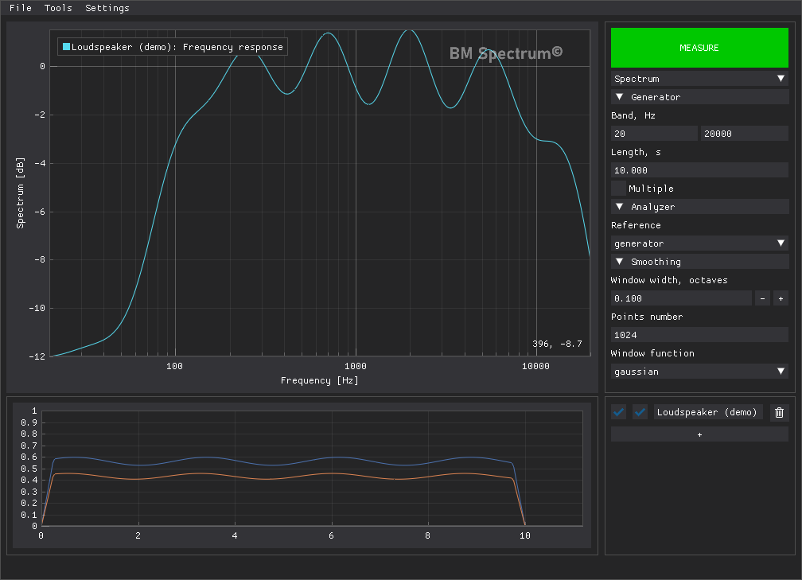

# BM Spectrum

BM Spectrum is a modular audio measurement application built with Python and
Dear PyGui. Version 0.3.2 uses an independent
measurement-module architecture and a reusable `audioanalysis` DSP library.

## Measurement modules

- **Spectrum** — logarithmic sweep or pink-noise spectrum measurement;
- **Impedance** — two-channel impedance magnitude and phase measurement;
- **Phase** — acoustic/electrical phase and delay measurement;
- **THD+N** — semi-analog swept residual distortion measurement;
- **RTA** — continuously updated real-time spectrum analyzer.

Measurements are stored independently inside a project and can display several
results on the same plot. Projects use the `.bms` format; individual
measurements can be transferred between projects as `.bmm` files. The plot can
also be exported directly to PNG.



The screenshot uses synthetic data to demonstrate the interface.

## What's new in 0.3.2

- SPICE impedance fitting adds resonant sections progressively, up to ten,
  and stops at the requested RMS log error. Set the target in **Settings ->
  Impedance** (default 2%). Resonance frequencies stay fixed while section
  widths are refined when necessary.
- Switching an empty measurement between modules no longer asks to discard
  data. Measurements containing recordings, calibration data or graphs still
  require confirmation.
- Sweep-band errors explain the frequency extension introduced by fades and
  the output Nyquist limit. Application device lists show default sample rates.
- Project, measurement and plot file operations use native system dialogs.
- A splash shows the application version and loading stages, closing after
  the first main-window frame. Windows executable builds show it during
  bootloader extraction as well; source runs and macOS use a lightweight Tk
  helper. A new spectrum icon and plot wordmark are included.

See [changelog.md](changelog.md) for the dated change history.

## Requirements

- Python 3.12 or newer;
- Tcl/Tk (`tkinter`), normally included with Python on Windows and macOS;
- an audio input/output device supported by PortAudio;
- Windows is the primary tested platform. macOS builds are produced by CI but
  still require broader hardware testing.

Install the runtime dependencies:

```bash
python -m pip install -r requirements.txt
```

Run the application:

```bash
python -m spectrum_app
```

`python run.py` is an equivalent entrypoint.

## Development

Run the test suite:

```bash
python -m unittest discover -s tests
```

The main source directories are:

- `spectrum_app/` — application core, GUI and measurement modules;
- `audioanalysis/` — reusable signal generation and analysis functions;
- `tests/` — application and DSP tests;
- `docs/design/` — architecture decisions and module contract.

Each measurement module owns its controls, state and workers, while audio
device access, projects, settings and the shared plot are managed by the
application core. See [`docs/design/module_contract.md`](docs/design/module_contract.md)
before adding a module.

## Release builds

See [the release process](docs/design/release-process.md) for automated source
cleanup, transfer to `main` and publication checks.

Pushing a version tag on `dev` automatically prepares `main`, builds Windows, macOS Intel and macOS Apple Silicon
archives and publishes them to GitHub Releases:

```bash
git switch dev
git push origin dev
git tag -a v0.3.2a -m "BM Spectrum v0.3.2a"
git push origin v0.3.2a
```

macOS bundles are currently not notarized. They may need to be opened through
Finder's **Open** context-menu command on first launch.
