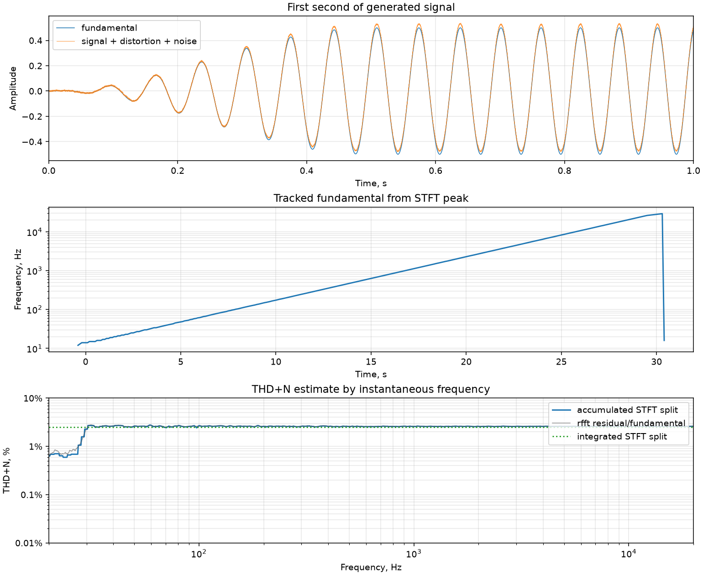
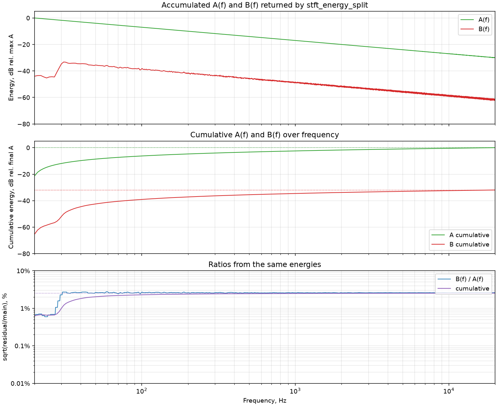
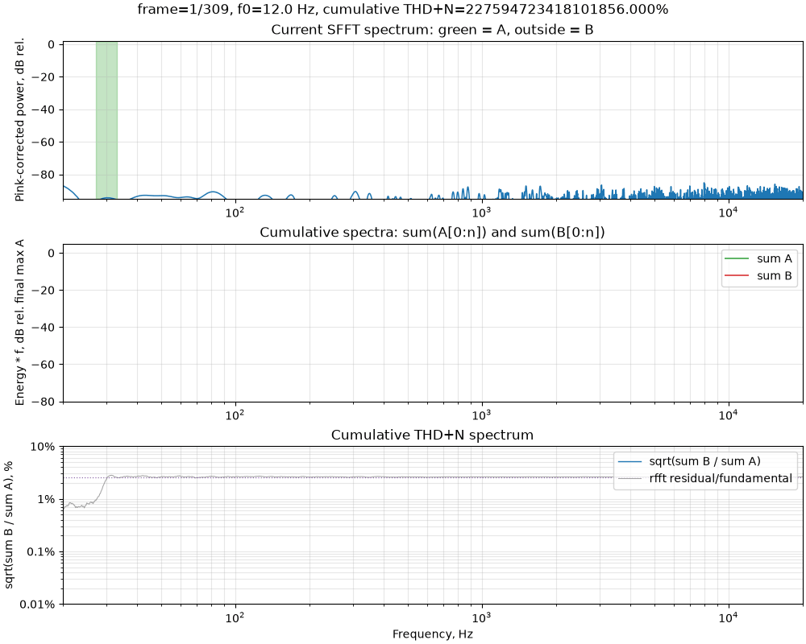
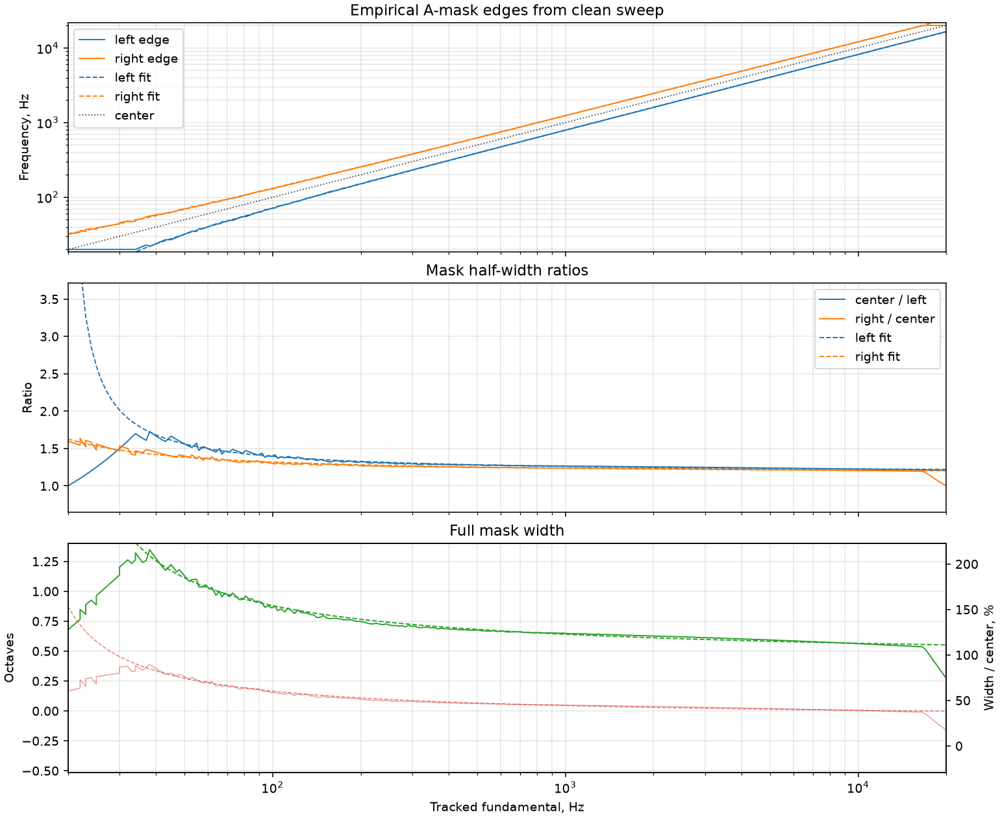
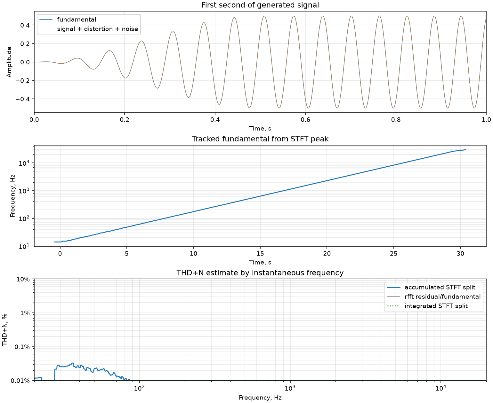
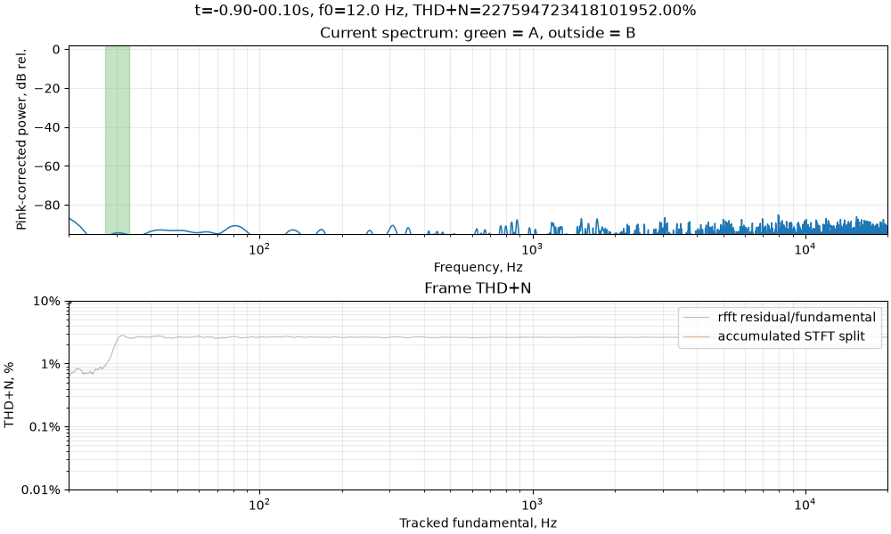

# Semi-Analog Sweep THD+N Method

This document describes an experimental sweep-based method for estimating
THD+N. The working name is the **Semi-Analog Sweep THD+N Method**.

The method is "semi-analog" in the sense that it follows the same operational
idea as a classical analog distortion analyzer: track the fundamental tone,
remove a narrow band around it, and treat the remaining in-band energy as
distortion plus noise. The difference is that the tone is not stationary. A
logarithmic sweep is used, and the fundamental rejection band is moved through
the STFT plane frame by frame.

The original experiment is in [`sandbox/thd4.py`](../sandbox/thd4.py). Its
reusable, plotting-independent implementation now lives in
[`audioanalysis/thd.py`](../audioanalysis/thd.py) and processes STFT frames
incrementally to keep memory use bounded.

## Test Signal Used for the Figures

The figures below were generated from a synthetic validation signal:

- Sample rate: `fs = 96000 Hz`.
- Duration: `30 s`.
- Analysis band: `20 Hz .. 20 kHz`.
- Generated sweep band: `13.333 Hz .. 30 kHz`.
- Sweep band expansion factor: `1.5`.
- Fade in/out: `0.5 s`.
- STFT window: `1 s` Hann window.
- STFT hop: `0.1 s`, or `90%` overlap.
- Fundamental amplitude: `0.5`.
- Nonlinearity: polynomial terms `x**n`, orders `2..5`, with coefficient
  `0.1**(n - 1)`.
- Noise: `1%` RMS pink noise relative to the fundamental RMS.

The generated sweep is wider than the analysis band so that fade-in and
fade-out happen outside the useful region. This avoids a false rise of
`B(f) / A(f)` at the analysis-band edges, where the fundamental energy would
otherwise collapse.

Current synthetic results:

```text
STFT split THD+N estimate: 2.528% (-31.94 dB)
Clean chirp leakage floor: 0.009% (-80.58 dB)
Oracle split:              2.533% (-31.93 dB)
```



## Core Idea

Let `y(t)` be the recorded response to a logarithmic sweep. The method computes
an STFT power matrix:

```text
P[n, k] = |STFT{y}[n, k]|^2
```

where `n` is the time-frame index and `k` is the frequency-bin index.

For every frame, the algorithm estimates the current fundamental frequency
`f0[n]`, constructs a frequency mask around it, and splits the frame power into
two vectors:

```text
A_n[k] = P[n, k], if k is inside the fundamental mask
       = 0,       otherwise

B_n[k] = P[n, k], if k is inside the analysis band but outside the mask
       = 0,       otherwise
```

The important point is that `A_n` and `B_n` are **vectors over frequency**, not
per-frame scalar sums. They are accumulated over all frames:

```text
A[k] = sum_n A_n[k]
B[k] = sum_n B_n[k]
```

The frequency-dependent THD+N estimate is then:

```text
THD+N[k] = sqrt(B[k] / A[k])
```

The integrated, scalar estimate is:

```text
THD+N_total = sqrt(sum_k B[k] / sum_k A[k])
```

This is equivalent in spirit to a swept analog notch analyzer: the moving
fundamental band is removed, and all other in-band energy is accumulated as
distortion plus noise.



## STFT Analysis

The implementation uses `scipy.signal.ShortTimeFFT`:

```text
window = Hann(1 s)
hop    = 0.1 s
mfft   = 1 s * fs
mode   = one-sided
```

`ShortTimeFFT.stft()` is used with its standard boundary behavior. The synthetic
signal uses a fade and an expanded sweep band so that padded edge frames do not
dominate the useful analysis band.

The STFT display in the animations uses a power correction proportional to
frequency when useful for visualization. This correction is only a display
operation; it is not part of the THD+N calculation.



## Fundamental Tracking

For each STFT frame, the fundamental frequency is estimated as the largest
positive-frequency bin:

```text
peak_index = argmax(P_source[n, 1:])
f0[n] = f[peak_index]
```

The DC bin is excluded. No artificial restriction to the analysis band is used:
the search range is `1 Hz .. fs/2`. This matters because the generated sweep is
wider than the analysis band, so the true fundamental can be below `20 Hz` at
the beginning and above `20 kHz` at the end.

The analysis band is used only later, when deciding which bins contribute to
`A` and `B`.

This tracker relies on a practical assumption:

> The fundamental component is louder than any harmonic or distortion product
> in each STFT frame.

That assumption is normally valid for THD+N measurements, where distortion is
expected to be significantly below the main tone. If the device is heavily
clipped, oscillating, generating a stronger subharmonic, or otherwise producing
distortion products louder than the fundamental, the peak tracker can lock to
the wrong component. In that case, an external reference sweep, a robust tracker,
or a constrained model-based tracker should be used.

## Empirical Fundamental-Mask Width

The central technical problem is choosing the mask width. A fixed ratio such as
`f0 / 1.25 .. f0 * 1.25` works poorly because a logarithmic sweep does not occupy
the same relative width in every STFT frame:

- At low frequencies, one STFT frame spans a relatively large frequency range
  in terms of bins and sweep curvature.
- At high frequencies, the sweep moves faster in absolute Hz, but the relative
  mask width can be narrower.
- Window leakage, STFT resolution, and the logarithmic sweep law make the left
  and right sides asymmetric.

The current implementation derives the mask width empirically from a clean
sweep.

For each clean-sweep frame:

1. Compute the STFT power spectrum `P_clean[n, k]`.
2. Find the positive-frequency peak `f0[n]`.
3. Compute a threshold as the mean frame power:

   ```text
   threshold[n] = mean_k P_clean[n, k]
   ```

4. Walk left from the peak until the power falls below the threshold.
5. Walk right from the peak until the power falls below the threshold.
6. Expand the detected width by `MASK_EXPANSION = 2.0`.
7. Clamp the empirical edges to the analysis band:

   ```text
   left_edge[n]  = max(BAND_LOW,  f0[n] - expansion * (f0[n] - raw_left[n]))
   right_edge[n] = min(BAND_HIGH, f0[n] + expansion * (raw_right[n] - f0[n]))
   ```

This produces empirical edge curves:

```text
left_edge_empirical(f0)
right_edge_empirical(f0)
```

The empirical curves are useful for calibration, but they should not be used
directly in a measurement. A real recording can be delayed relative to the
generated sweep, and frame number is therefore not a stable coordinate. The
mask must be expressed as a function of tracked frequency.

## Fitting `w_left(f)` and `w_right(f)`

The mask is parameterized as two independent frequency ratios:

```text
w_left(f)  = f / left_edge(f)
w_right(f) = right_edge(f) / f
```

The fitted mask edges are then:

```text
left_edge(f)  = f / w_left(f)
right_edge(f) = f * w_right(f)
```

Both ratios are fitted with the same reciprocal-log model:

```text
w(f) = a / log(b * f) + c
```

The left and right fits use different frequency ranges:

```text
w_left fit range:  [2 * BAND_LOW, BAND_HIGH]
w_right fit range: [BAND_LOW,     BAND_HIGH / 2]
```

The ranges are intentionally asymmetric. The left edge is most sensitive to
low-frequency STFT resolution and the right edge is most sensitive to
high-frequency band-edge behavior. Using separate fit ranges reduces the error
of both functions in the region where each side matters most.

Current fitting bounds:

```text
a: [0, 10]
b: [1 / BAND_LOW, 10]
c: [1, 3]
```

The fitted model is smooth, delay-independent, and can be evaluated at the
fundamental frequency found in the recorded signal.



## Per-Frame A/B Energy Split

For a measured frame `n`, the algorithm:

1. Finds `f0[n]` from the largest positive STFT bin.
2. Evaluates `w_left(f0[n])` and `w_right(f0[n])`.
3. Converts these ratios to mask edges.
4. Builds the main-tone mask:

   ```text
   M_n[k] = BAND_LOW <= f[k] <= BAND_HIGH
            and left_edge(f0[n]) <= f[k] <= right_edge(f0[n])
   ```

5. Writes the frame energy into two frequency vectors:

   ```text
   A_n[k] = P[n, k] if M_n[k] else 0
   B_n[k] = P[n, k] if in_band[k] and not M_n[k] else 0
   ```

The split is done before summation. This is essential. If each frame is first
collapsed to scalar `sum(A_n)` and `sum(B_n)`, then harmonic energy is assigned
to the fundamental frequency of that frame, which produces incorrect curves at
low and high frequencies. Keeping `A_n[k]` and `B_n[k]` as vectors preserves the
frequency coordinate of the residual energy.

## Accumulation and THD+N

After every frame has been split:

```text
A[k] = sum_n A_n[k]
B[k] = sum_n B_n[k]
```

The per-frequency estimate is:

```text
THD+N[k] = sqrt(B[k] / max(A[k], epsilon))
```

The square root is required because `A` and `B` are power/energy quantities.
The result is an amplitude ratio, which can be shown as percent or dB:

```text
THD+N_percent[k] = 100 * THD+N[k]
THD+N_dB[k]      = 20 * log10(THD+N[k])
```

The displayed THD+N curve is lightly smoothed in log-frequency space by
averaging ratio power over a `1/24` octave window. This smoothing is only for
display. The scalar integrated metric uses the unsmoothed accumulated energies:

```text
THD+N_total = sqrt(sum_k B[k] / sum_k A[k])
```

## Relation to Farina's Exponential Sine Sweep Method

Angelo Farina's exponential sine sweep (ESS) method excites the system with a
logarithmic sweep and then deconvolves the recorded signal with an inverse
sweep. The deconvolved result contains a linear impulse response and separated
nonlinear impulse responses corresponding to harmonic orders. Farina's paper
describes the use of a single long logarithmic sweep to obtain a high-SNR
linear response and well-separated harmonic distortion responses in one
measurement pass. See Farina, "Simultaneous Measurement of Impulse Response and
Distortion with a Swept-Sine Technique" (AES 108th Convention, 2000):
<https://angelofarina.it/Public/Papers/134-AES00.PDF>.

Later swept-sine work, for example Novak's synchronized swept-sine formulation,
focuses on synchronization and inverse-filter construction for accurate harmonic
impulse responses:
<https://ant-novak.com/posts/research/2015-10-30_JAES_Swept/>.

The Semi-Analog Sweep THD+N Method is different:

- It does not deconvolve the recording.
- It does not reconstruct impulse responses.
- It does not separate harmonic orders.
- It estimates the total in-band residual energy outside the moving fundamental
  mask.

In Farina-style analysis, harmonic distortion products are separated in the
deconvolved time domain. In this method, distortion and noise are separated in
the STFT frequency domain by a moving fundamental mask.

## Advantages

- **Direct THD+N estimate.** The method estimates total distortion plus noise
  directly, which is often the desired quantity for analog-style measurements.
- **No inverse filter.** There is no sweep inversion, no deconvolution, and no
  requirement to window separated harmonic impulse responses.
- **Noise is naturally included.** Everything in the analysis band outside the
  fundamental mask contributes to `B(f)`.
- **Delay tolerant.** The mask is evaluated from the tracked frequency in the
  recording. It is not tied to the generated frame number.
- **Frequency-resolved result.** The method produces `THD+N(f)`, not only a
  single scalar.
- **Good visual diagnostics.** The STFT plane, cumulative `A(f)`, cumulative
  `B(f)`, and `THD+N(f)` can be inspected directly.
- **Useful when harmonic order is not important.** For many device tests, total
  residual energy is more relevant than separated second-, third-, and
  fourth-order responses.

## Limitations

- **No harmonic-order separation.** The method cannot say how much of `B(f)` is
  second harmonic, third harmonic, noise, aliasing, hum, or unrelated
  interference.
- **Fundamental must dominate.** The peak tracker assumes the fundamental is the
  strongest positive-frequency component in each frame.
- **Mask fit matters.** Too narrow a mask leaks fundamental energy into `B`; too
  wide a mask hides real nearby distortion or noise.
- **STFT resolution tradeoff.** Low-frequency accuracy requires long windows,
  while time localization requires shorter hops. The current experiment uses a
  `1 s` Hann window and `90%` overlap.
- **Band-edge behavior must be handled.** The sweep should extend beyond the
  analysis band so that fade-in/fade-out and STFT padding do not create
  artificial `B/A` spikes.
- **Strong time variance can blur energy.** The method is robust to fixed delay,
  but a device whose response changes rapidly during the sweep can still smear
  energy across the mask boundary.
- **Not a replacement for impulse-response analysis.** If the goal is room
  acoustics, linear impulse response, or harmonic impulse responses, Farina ESS
  remains the more appropriate framework.

## Interpretation of the Figures

### Summary Plot


The top panel shows the first second of the synthetic sweep. The middle panel
shows the tracked fundamental frequency. The bottom panel compares:

- the semi-analog accumulated STFT split,
- the direct FFT ratio of the known residual to the known fundamental, and
- the integrated THD+N scalar.

### Clean Leakage Floor



This plot uses a clean sweep with no added distortion and no added noise. The
reported leakage floor is the residual energy caused by finite STFT resolution,
mask fitting error, window leakage, and band-edge effects.

### A/B Breakdown


This plot shows the actual accumulated `A(f)` and `B(f)` spectra used in the
calculation. The lower panel computes ratios from the same energy vectors.

### Mask Width Fit


This plot shows the empirical clean-sweep mask edges and the fitted
`w_left(f)` / `w_right(f)` functions.

### Frame-by-Frame Accumulation


This animation shows the current STFT frame, cumulative `sum(A[0:n])` and
`sum(B[0:n])`, and the evolving `sqrt(sum(B[0:n]) / sum(A[0:n]))` curve.

### Real-Time STFT View



This animation emphasizes how the moving mask follows the tracked fundamental
while the cumulative THD+N curve develops.

## Summary

The Semi-Analog Sweep THD+N Method measures distortion plus noise by tracking a
logarithmic sweep in the STFT domain, masking out the fundamental, and
accumulating all remaining in-band energy as residual. It is simpler than
Farina-style deconvolution when the target metric is THD+N rather than impulse
responses or separated harmonic orders.

The method is promising because it combines analog-analyzer intuition with a
single broadband sweep and produces both a scalar THD+N estimate and a
frequency-resolved `THD+N(f)` curve.
